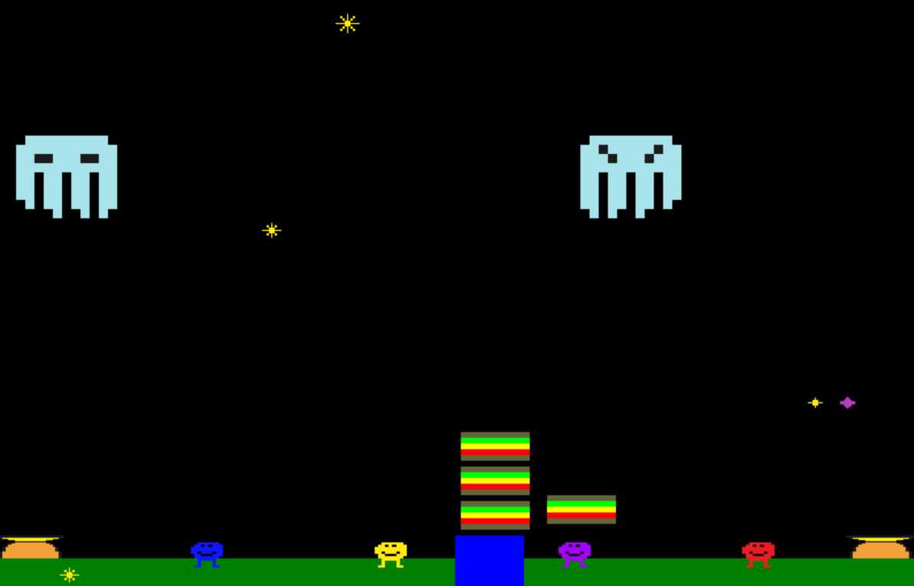
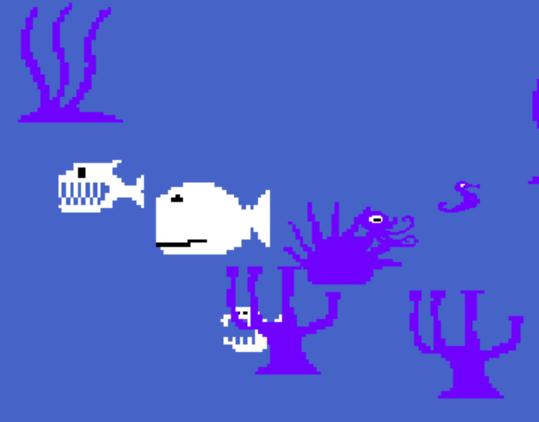

# tmntcade
Source files to add open source games to a RetroPi


## My paths

On the RetroPi run:
```
sudo apt-get install python-pygame
```

Copy everything in joytest to:

Deploy these to PORTS using this command:
```
./deploy.ps1
```

Restart EmulationStation.

## The Games

### Sandwich Panic!

A clone of "Peanut Butter Panic", lovingly updated for four players.

Peanut Butter Panic! was easily one of my favorite games for the good old Commordore 64.
It was a part of my inspiration to become a programmer.
This four player tribute is presented along with
full open source code in the hopes of inspiring at least a few smiles and maybe a few careers.


### About Peanut Butter Panic

Peanut Butter Panic for the Commodore 64 was created by the CTW Software Group - a US software development group, part of Children's Computer Workshop, Inc.

They mainly developed educational games and software based on the Sesame Street license. So technically, **Nutniks ought to count as muppets**. There's probably little hope that "Muppets Now!" will rediscover these little guys that were a big part of my childhood - but I can dream.

My eternal thanks to the **CTW Software Group Development Team for Peanut Butter Panic:**

Harold Byrd, Dick Codor, Sandy Damashek, Bernie De Koven,
Lisa Feder, Laura Kurland, Dan Oehlsen, Mary Schenck Balcer, Alan Shapiro, Debra Weinberger

Your work continues to inspire me.



### The Original Welcome Message from Peanut Butter Panic

```
* * * * * * * * * * * * * 
    Welcome Nutniks!
* * * * * * * * * * * * * 

Your goal is to make 
as many sandwiches as 
you can by catching
stars to power your
sandwich machine.
```

### Undersea Hide and Seek

Match your color to the scenery as you try to reach your cozy sunken ship without being seen.

Undersea Hide and Seek is Copyright 2020 Edward Delaporte

#### Inspired by Seahorse Hide and Seek by Joyce Hakansson and CBS Software

[21]: https://artsandculture.google.com/asset/video-game-commodore-64-sea-horse-hide-n-seek/WAGzMakMQ4NVgA?hl=en

Undersea Hide and Seek is a tribute to [Seahorse Hide and Seek - another classic by CBS Software.][21]

Seahorse Hide and Seek is Copyright 1984 Joyce Hakansson



## Contributing

+ Recommended Editor: [VSCode](https://code.visualstudio.com/)
+ Requirements:
  + [Python3](https://www.python.org/downloads/) **BE SURE TO CHECK THE BOX TO INCLUDE PIP**
  + [Chocolatey](https://chocolatey.org/install) - To support the commands below.
  + pygame - Install command is included below.

1. In an admin terminal:
```powershell
choco install pip
pip install pygame
```

2. In a non-admin terminal:
```powershell
git clone https://github.com/edthedev/tmntcade.git
make test
```

3. Optional - Setup an SSH key to make pushing to GitHub easier.
```
choco install gnupg
gpg --full-generate-key
```

## References

- [Python Installer][1]
- [PyGame for RetroPi Tutorial][2]
- [PyGame Examples][3]

[3]: http://programarcadegames.com/index.php?chapter=example_code
[1]: https://www.python.org/downloads/
[2]: https://robotloveskitty.tumblr.com/post/128521211646/getting-ready-for-some-raspberry-jam

## Did Not Work

- [MagPi PyGameZero Examples][4]

[4]: https://github.com/themagpimag/retro-gaming
